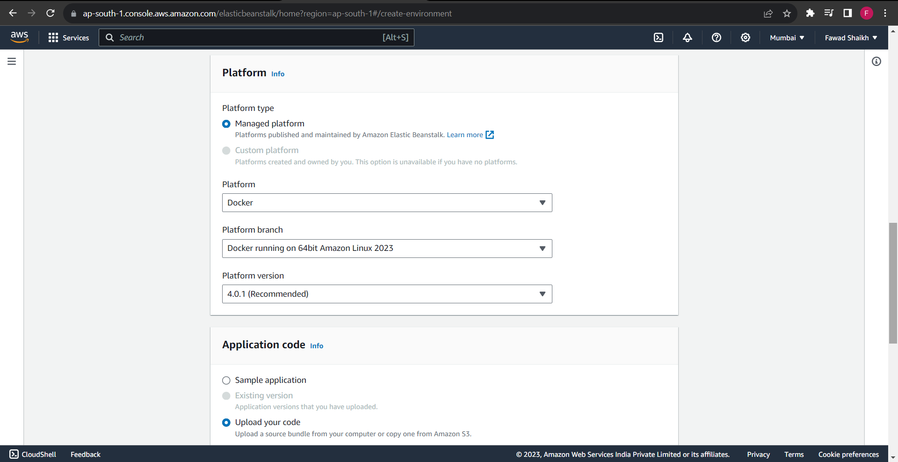
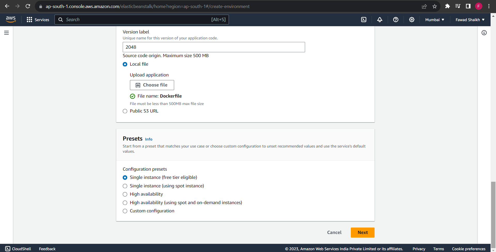

# DevOps-Project
DevOps Project - Create a Game using Docker and Deploy to AWS

<!-- Project Overview -->
<h2>Project Overview</h2>

In this project, i have  created a Docker container for the 2048 game developed by gabrielecirulli and deploy it to Amazon Elastic Beanstalk. This will allow us to host the game on AWS with the help of Docker for containerization.

<!-- Tools and OS Used -->
<h2>Tools and OS Used</h2>
<ul>
  <li><strong>Operating System:</strong> Ubuntu 22.04.2 LTS (Jammy Jellyfish) on WSL (Windows Subsystem for Linux)</li>
  <li><strong>Code Editor:</strong> Visual Studio Code</li>
</ul>

<!-- Step-by-Step Project Execution -->
<h2>Step-by-Step Project Execution</h2>

<ol>
  <li><strong>Create Project Directory:</strong> creating a directory named "2048" using the following command: <code>mkdir 2048</code></li>

  <li><strong>Open Visual Studio Code:</strong> Navigate to the project directory and open Visual Studio Code using the following command: <code>code .</code></li>

  <li><strong>Create a Dockerfile:</strong> Inside the project directory, create a file named <code>Dockerfile</code>. This file contains instructions for building a Docker image for the game.</li>

  <li><strong>Write Dockerfile:</strong> In the <code>Dockerfile</code>, i have specified necessary configuration,which is available in this repository.
  </li>

  <li><strong>Build Docker Image:</strong> Build the Docker image using the following command: <code>docker build -t 2048-game .</code></li>

  <li><strong>Check Docker Images:</strong> Verifying  that the Docker image has been successfully built by running: <code>docker images</code></li>

  <li><strong>Create Docker Container:</strong> Creating a Docker container from the image with the following command: <code>docker run -d -p 80:80 &lt;image_id&gt;</code> Replace &lt;image_id&gt; with the actual image ID from the previous step.</li>

  <li><strong>Test Locally:</strong> Access the game locally by opening a web browser and navigating to <code>http://localhost</code>. The 2048 game should be accessible.</li>

  <li><strong>Login to AWS Console:</strong> Log in to your AWS console to prepare for deploying the Docker container on Amazon Elastic Beanstalk. <code>aws configure</code> Follow the prompts to configure your AWS CLI with your access key and secret key.</li>

  <li><strong>Deploy to AWS Elastic Beanstalk:</strong> Use AWS Elastic Beanstalk to deploy your Docker container. This step involves creating an Elastic Beanstalk environment, uploading your Docker container, and configuring the environment.
    <ul>
      <li>Create an Elastic Beanstalk environment for Docker.</li>
      <li>Upload your Docker container to Elastic Beanstalk.</li>

  here are the configurations,

  
  
    
    
    
    
      <li>Configure environment variables, scaling options, and other settings as needed.</li>
    </ul>
  </li>
  <li><strong>Access the Game on AWS:</strong> Once the Elastic Beanstalk environment is up and running, access your 2048 game on AWS using the provided URL.</li>

